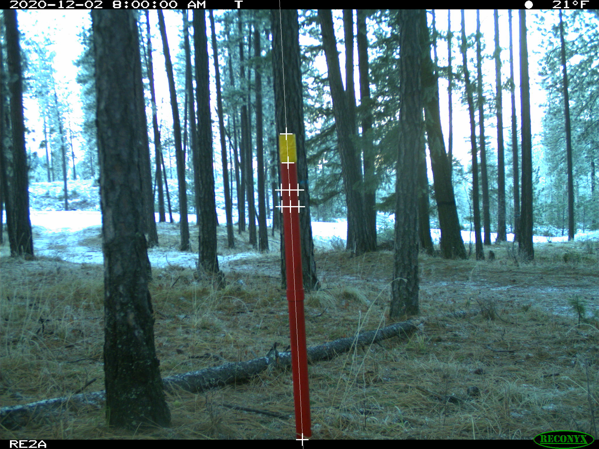

# Hydrology Research Tool - Pole Detection w/ Uwing Library

---

## Contents

- <a href="#background">Background</a>
- <a href="#description">Project Description</a>
- <a href="#algorithm">Developed Algorithm</a>
- <a href="#results">Results</a>
- <a href="#credits">Credits</a>

## GitHub Repository
- [jamesswartwood/uwing-pole-detection](https://www.youtube.com/watch?v=dQw4w9WgXcQ)

---

<section id="background">

## Background

In hydrology studies in the last decade, red poles installed in front of remote cameras due to the advantage of providing continuous monitoring of snow depth through snow height change on the pole in the images. So far, manual extraction of the snow depth is recommended because current methods of automated extraction often produce inaccurate results, as daylight and weather changes influence the color and textures of the stakes. Manual extraction involves calculating the length in pixels of the portion of the snow depth stake that is visible to the camera. The snow depth around the stake can then be estimated by subtracting that from the known length of the stake and converting the pixel count into the metric system. This process requires prior knowledge of the camera intrinsics and the placement of the pole.

Example images:


---

<section id="description">

## Project Description
 
In this project, we explored methods to automate detecting the top and bottom points of the red poles using the [uwing] computer vision library that students develop while taking CSE 455 at the University of Washington, Seattle. This approach must account for differences in pole locations in the images and weather/daylight images that make change pixel color values. There are many ways to implement the detection of objects in an image.

---

<section id="algorithm">

## Developed Algorithm

This is a general summary of the algorithm. Small intermediate steps are glossed over. For full understanding of process, refer to the code itself.

The code for this project can be found in this dedicated GitHub repository: [jamesswartwood/uwing-pole-detection](https://www.youtube.com/watch?v=dQw4w9WgXcQ)

```markdown
1. Sweep image for red pixel.
2. Expand sideways from the red pixel, identifying potential edges of the pole and measuring prospective pole width.
3. Travel either up or down from the original red pixel a distance of the measured width.
    - Make sure no edge is hit in the process. This ensures that we land on another pixel on the body of the pole. Otherwise, continue step 1.
4. Expand sideways from this second red pixel, identifying potential edges of the pole and measuring prospective pole width.
    - If the second measured pole width matches the first, we have found the pole. Otherwise, continue step 1.
5. Use the identified pixels and measured pole widths to find two points along the very center of the pole.
6. Calculate the tilt of the pole by finding the slope between the two points.
7. Project down the length of the pole using the measured slope to find the bottom edge. Before the bottom is found, occasionally recalibrate to the center of the pole to account for any bend in the pole and recalculate the slope.
8. Project up the length of the pole to find top edge of the red portion of the pole.
9. Project up further still to find the top edge of the yellow portion of the pole.
10. Output the top and bottom points of the pole. Update the image with annotations of the detection.
```

---

<section id="results">

## Results

These results are a small sample of all the images this algorithm was tested on. Full results can be found on GitHub: [jamesswartwood/uwing-pole-detection](https://www.youtube.com/watch?v=dQw4w9WgXcQ)




---

<section id="credits">

## Credits

### Author

Updated 06/02/2022 - [James Swartwood](https://www.linkedin.com/in/jamesswartwood/) is a third-year student at the Paul G. Allen School of Computer Science and Engineering at the University of Washington. He aspires to become a computer vision developer and machine learning engineer.

### Acknowledgements

Thank you to Catherine Breen, the environmental scientist consulted during this project.

Thank you to Dr. Joseph Redmon for teaching the CSE 455 class and providing insight into computer vision methods for this project.